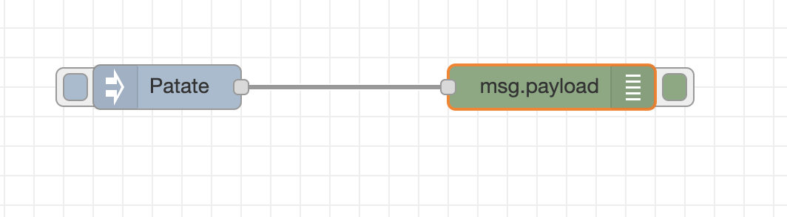

# Welcome in the node-red workshop !

## Short presentation

TODO

## Installation

- Clone this repository & move into the directory
- start docker `docker-compose up` (it will run node-red & mongodb)

## Security (source : https://nodered.org/docs/user-guide/runtime/securing-node-red)

By default, the Node-RED editor is not secured - anyone who can access its IP address can access the editor and deploy changes.

Let's securise it !

You'll need to edit the `settings.js` in the `.node-red` folder...

If you want to go in this folder, you'll need to run the cmd in the docker container:

- get the container id with : `docker ps`

  

- run the bash of the container : `docker exec -it <container id> /bin/bash`

- Welcome in the bash of the contrainer

- first install the `node-red-admin` tool with : `npm install -g node-red-admin`

- generate a password and copy the result : `node-red-admin hash-pw` (Don't forget to kill it ! You'll get something like this : "$2a$08\$71Vr0fW17O1Jl1BzfA7NGOYO6dSSANyZBwLxdr0QFd..0O3ihpzoS")

- Edit the `settings.js` file : `vi /data/settings.js`

- Welcome in hell... (vim), go near the line 123, you'll find a `adminAuth` object, just uncomment with the `X` key (or press `I` to get the `insert mode`)

- With the insert mode change the password by the password you generated earlier

- quit & save vi (`:wq` or `maj + ZZ`)

- if you want to leave the docker container bash : `ctrl + D`

- turn off docker (`ctrl + c`), restart docker (`docker-compose up`)

## Getting start

Node-red is setup and "securised" !

You can go on this page : `http://127.0.0.1/:1880`

### Hello world

- First drag-&-drop from the palette `inject` and `debug` into the workspace

- Wire `inject` to `debug`

- Click on `inject` and change his value

- Click on deploy & click on the button on the left of `inject`. You will see in the debug tab the value of `inject`

  

### If

## Api ?
